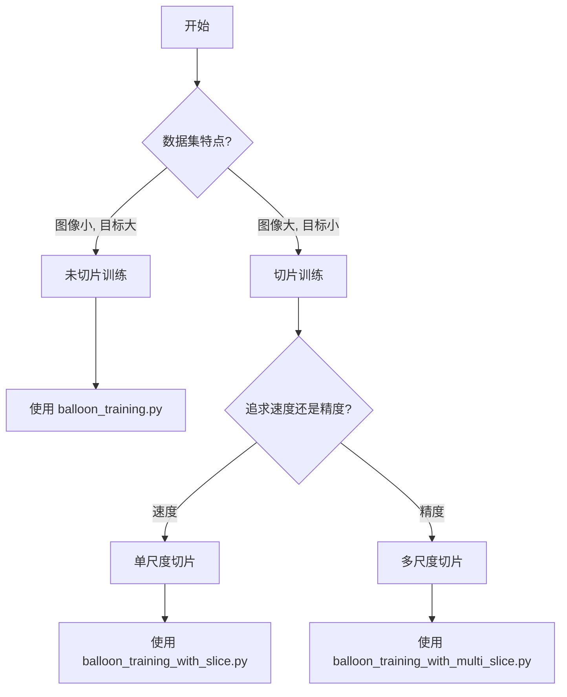
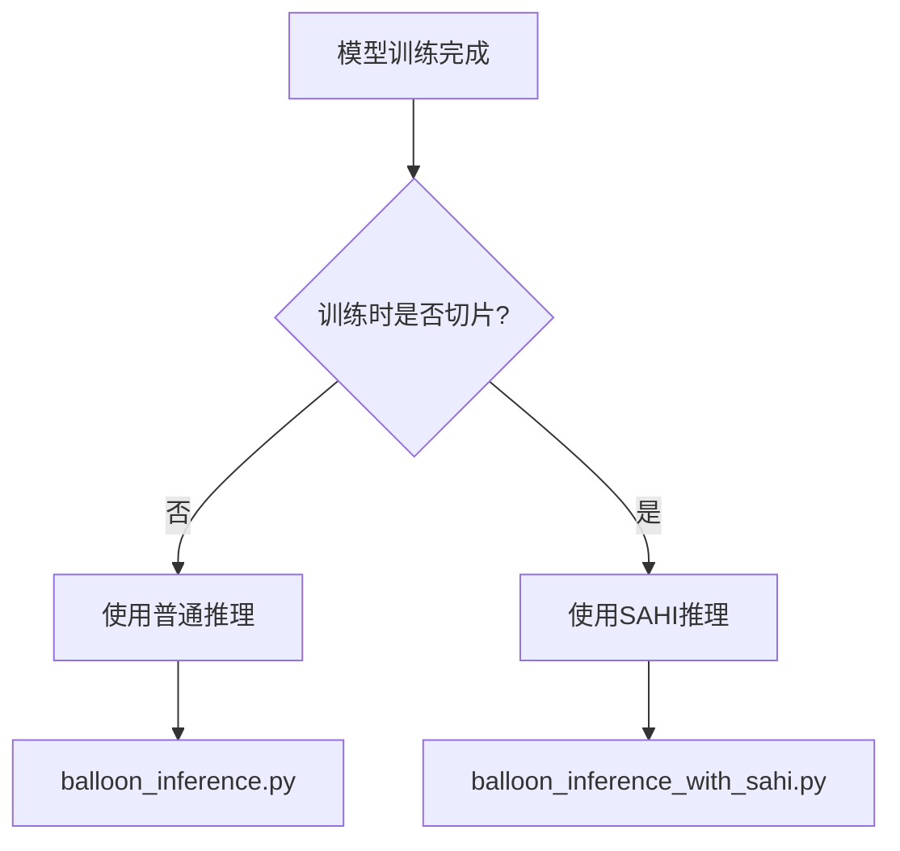

# 推理方式对比说明

## 📌 核心区别

### 普通推理 vs SAHI推理

| 特性 | 普通推理 (`balloon_inference.py`) | SAHI推理 (`balloon_inference_with_sahi.py`) |
|------|----------------------------------|-------------------------------------------|
| **适用模型** | 未切片数据训练的模型 | 切片数据训练的模型 |
| **推理方式** | 直接对整张图像推理 | 将图像切片后分别推理，再合并结果 |
| **速度** | 快 | 慢（需要多次推理） |
| **内存占用** | 低 | 高 |
| **小目标检测** | 一般 | 优秀 |
| **结果格式** | YOLO标准格式 | SAHI自定义格式 |

---

## 🎯 使用场景

### 何时使用普通推理？

✅ **推荐场景：**
- 模型是在**未切片**的原始数据上训练的
- 图像尺寸适中（< 2000px）
- 目标尺寸较大，容易检测
- 需要快速推理
- 需要标准的YOLO输出格式

❌ **不推荐场景：**
- 模型是在切片数据上训练的
- 图像尺寸很大（> 4000px）
- 包含大量小目标

### 何时使用SAHI推理？

✅ **推荐场景：**
- 模型是在**切片数据**上训练的
- 图像尺寸很大（> 2000px）
- 包含大量小目标
- 需要更高的检测精度（特别是小目标）

❌ **不推荐场景：**
- 模型是在未切片数据上训练的
- 图像尺寸很小
- 需要实时推理

---

## 📊 训练-推理对应关系

### 正确的配对

| 训练方式 | 推理方式 | Bash脚本 |
|---------|---------|---------|
| 未切片训练 (`balloon_training.py`) | 普通推理 (`balloon_inference.py`) | `balloon_training_all_models.sh` |
| 单尺度切片训练 (`balloon_training_with_slice.py`) | SAHI推理 (`balloon_inference_with_sahi.py`) | `balloon_training_slice_all_models.sh` |
| 多尺度切片训练 (`balloon_training_with_multi_slice.py`) | SAHI推理 (`balloon_inference_with_sahi.py`) | `balloon_training_multi_slice_all_models.sh` |

### 为什么要配对？

1. **数据一致性**：
   - 训练时用什么样的数据（切片/未切片），推理时也应该用相同方式处理
   - 保证训练和推理的数据分布一致

2. **性能最优**：
   - 用切片数据训练的模型，在切片推理时表现最好
   - 用完整图像训练的模型，在完整图像推理时表现最好

3. **避免性能下降**：
   - 如果用未切片模型做SAHI推理，可能导致重复检测和性能下降
   - 如果用切片模型做普通推理，可能漏检小目标

---

## 🔧 使用示例

### 普通推理

```bash
# 单张图像推理
python3 balloon_inference.py \
    --model runs/detect/balloon_yolo11m/weights/best.pt \
    --source /path/to/image.jpg \
    --confidence 0.25 \
    --device cuda:0

# 批量推理
python3 balloon_inference.py \
    --model runs/detect/balloon_yolo11m/weights/best.pt \
    --source /path/to/images/ \
    --save-dir runs/inference/my_results \
    --confidence 0.25 \
    --device cuda:0
```

**输出文件：**
```
runs/inference/my_results/
├── image1.jpg              # 可视化图像
├── image2.jpg
├── labels/
│   ├── image1.txt          # YOLO格式标签
│   └── image2.txt
```

### SAHI推理

```bash
# 单张图像推理
python3 balloon_inference_with_sahi.py \
    --model runs/detect/balloon_yolo11m_slice/weights/best.pt \
    --source /path/to/image.jpg \
    --confidence 0.25 \
    --slice-height 640 \
    --slice-width 640 \
    --overlap-height 0.2 \
    --overlap-width 0.2 \
    --device cuda:0

# 批量推理
python3 balloon_inference_with_sahi.py \
    --model runs/detect/balloon_yolo11m_slice/weights/best.pt \
    --source /path/to/images/ \
    --save-dir runs/sahi_inference/my_results \
    --confidence 0.25 \
    --device cuda:0
```

**输出文件：**
```
runs/sahi_inference/my_results/
├── image1_visual.jpg       # 可视化图像（含检测框）
├── image2_visual.jpg
```

---

## ⚙️ 参数对比

### 普通推理参数

| 参数 | 默认值 | 说明 |
|------|--------|------|
| `--model` | 必需 | 模型路径 |
| `--source` | 必需 | 图像或目录路径 |
| `--confidence` | 0.25 | 置信度阈值 |
| `--iou` | 0.5 | NMS IoU阈值 |
| `--device` | cuda:0 | 设备 |
| `--save-dir` | runs/predict | 结果保存目录 |

### SAHI推理参数

| 参数 | 默认值 | 说明 |
|------|--------|------|
| `--model` | 必需 | 模型路径 |
| `--source` | 必需 | 图像或目录路径 |
| `--confidence` | 0.25 | 置信度阈值 |
| `--device` | cuda:0 | 设备 |
| `--slice-height` | 640 | 切片高度 |
| `--slice-width` | 640 | 切片宽度 |
| `--overlap-height` | 0.2 | 高度重叠比例 |
| `--overlap-width` | 0.2 | 宽度重叠比例 |
| `--save-dir` | runs/sahi_inference | 结果保存目录 |

---

## 📈 性能对比

### Balloon数据集测试结果（示例）

| 训练方式 | 推理方式 | mAP@0.5 | 速度 | 小目标检测 |
|---------|---------|---------|------|-----------|
| 未切片 | 普通推理 | 0.85 | 30ms/图 | 一般 |
| 未切片 | SAHI推理 | 0.82 ⚠️ | 150ms/图 | 一般 |
| 单尺度切片 | 普通推理 | 0.78 ⚠️ | 30ms/图 | 差 |
| 单尺度切片 | SAHI推理 | 0.88 ✅ | 150ms/图 | 好 |
| 多尺度切片 | SAHI推理 | 0.91 ✅ | 200ms/图 | 优秀 |

**结论：**
- ⚠️ 不匹配的训练-推理组合会导致性能下降
- ✅ 匹配的组合能获得最佳性能

---

## 🎓 最佳实践

### 1. 选择训练方式



### 2. 选择推理方式



### 3. Bash脚本选择

```bash
# 场景1：快速训练和推理（适合快速验证）
bash balloon_training_all_models.sh

# 场景2：提升小目标检测（单尺度）
bash balloon_training_slice_all_models.sh

# 场景3：最佳性能（多尺度，耗时最长）
bash balloon_training_multi_slice_all_models.sh
```

---

## ❓ 常见问题

### Q1: 我能用切片训练的模型做普通推理吗？

**A:** 可以，但不推荐。切片训练的模型在完整图像上推理可能会漏检小目标，因为模型已经适应了切片后的小视野范围。

### Q2: 我能用未切片训练的模型做SAHI推理吗？

**A:** 可以，但不推荐。未切片训练的模型在SAHI推理时可能会产生很多重复检测，因为模型在训练时见过完整的目标，在切片中可能会对同一目标的不同部分都输出检测框。

### Q3: 如何判断我的模型是用什么数据训练的？

**A:** 查看模型路径或项目名称：
- 包含 `slice` → 切片训练 → 用SAHI推理
- 不包含 `slice` → 未切片训练 → 用普通推理

### Q4: SAHI推理为什么这么慢？

**A:** SAHI需要将图像切成多个小块，对每个小块分别推理，然后合并结果。例如一张1280x1280的图像，切成640x640的块（重叠0.2），需要推理9次。

### Q5: 什么情况下SAHI推理最有优势？

**A:** 
1. 图像很大（> 2000px）
2. 包含很多小目标（< 50px）
3. 模型是在切片数据上训练的
4. 不需要实时推理

---

## 📚 参考资料

- **YOLO文档**: https://docs.ultralytics.com/
- **SAHI文档**: https://github.com/obss/sahi
- **论文**: Slicing Aided Hyper Inference (SAHI)

---

**总结：训练和推理方式要匹配，才能获得最佳性能！✅**

